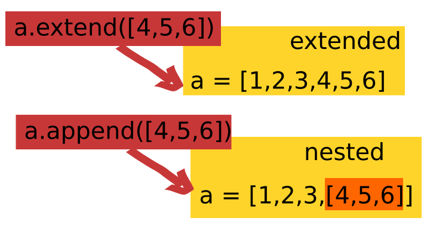

Useful Python Function in Coding Interview
=====================================
### Author: Weiwei Ouyang

Outline
=====================================
* [Counter from collections module](#Counter)
* [Append and Extend in Python](#add)
* [enumerate function](#enum)
* [map function](#map)
* [zip and unzip in Python](#zip)

<a name="Counter"></a>
### Important Counter modeule in python
``` Python
>>> from collections import Counter
>>> 
>>> myList = [1,1,2,3,4,5,3,2,3,4,2,1,2,3]
>>> print Counter(myList)
Counter({2: 4, 3: 4, 1: 3, 4: 2, 5: 1})
>>>
>>> print Counter(myList).items()
[(1, 3), (2, 4), (3, 4), (4, 2), (5, 1)]
>>> 
>>> print Counter(myList).keys()
[1, 2, 3, 4, 5]
>>> 
>>> print Counter(myList).values()
[3, 4, 4, 2, 1]
``` 

<a name="add"></a>
### Extend and Append in Python List


<a name="enum"></a>
### Enumerate in dictionary and list
``` Python
enumm = {0: 1, 1: 2, 2: 3, 4: 4, 5: 5, 6: 6, 7: 7}
for k, v in enumm.items():
    print(k, v)

Output:
0 1
1 2
2 3
4 4 
5 5
6 6
7 7

```
if you'd like to enumerate over the index, key, and values of a dictionary, your for loop should look like this:
``` Python
for index, (key, value) in enumerate(your_dict.items()):
    print(index, key, value)
```

<a name="map"></a>
### Map function
map() function returns a list of the results after applying the given function to each item of a given iterable (list, tuple etc.)
``` Python
# Return double of n 
def addition(n): 
    return n + n 
  
# We double all numbers using map() 
numbers = (1, 2, 3, 4) 
result = map(addition, numbers) 
print(list(result)) 

output:
{2, 4, 6, 8}
``` 
``` Python
numbers1 = [1, 2, 3] 
numbers2 = [4, 5, 6] 
  
result = map(lambda x, y: x + y, numbers1, numbers2) 
print(list(result)) 

Output:
[5, 7, 9]

```
<a name="zip"></a>
### Zip and unzip in Python
``` Python
name = [ "Manjeet", "Nikhil", "Shambhavi", "Astha" ] 
roll_no = [ 4, 1, 3, 2 ] 
marks = [ 40, 50, 60, 70 ] 
  
# using zip() to map values 
mapped = zip(name, roll_no, marks) 
  
# converting values to print as list 
mapped = list(mapped) 
  
# printing resultant values  
print ("The zipped result is : ",end="") 

Output:
The zipped result is : [('Manjeet', 4, 40), ('Nikhil', 1, 50), 
('Shambhavi', 3, 60), ('Astha', 2, 70)]

``` 

``` Python
# unzipping values 
namz, roll_noz, marksz = zip(*mapped) 
  
print ("The unzipped result: \n",end="") 
  
# printing initial lists 
print ("The name list is : ",end="") 
print (namz) 
  
print ("The roll_no list is : ",end="") 
print (roll_noz) 
  
print ("The marks list is : ",end="") 
print (marksz)

Output:
The unzipped result: 
The name list is : ('Manjeet', 'Nikhil', 'Shambhavi', 'Astha')
The roll_no list is : (4, 1, 3, 2)
The marks list is : (40, 50, 60, 70)
``` 

``` Python
# initializing list of players. 
players = [ "Sachin", "Sehwag", "Gambhir", "Dravid", "Raina" ] 
  
# initializing their scores 
scores = [100, 15, 17, 28, 43 ] 
  
# printing players and scores. 
for pl, sc in zip(players, scores): 
    print ("Player :  %s     Score : %d" %(pl, sc)) 
    
Output:
Player :  Sachin     Score : 100
Player :  Sehwag     Score : 15
Player :  Gambhir     Score : 17
Player :  Dravid     Score : 28
Player :  Raina     Score : 43

```
